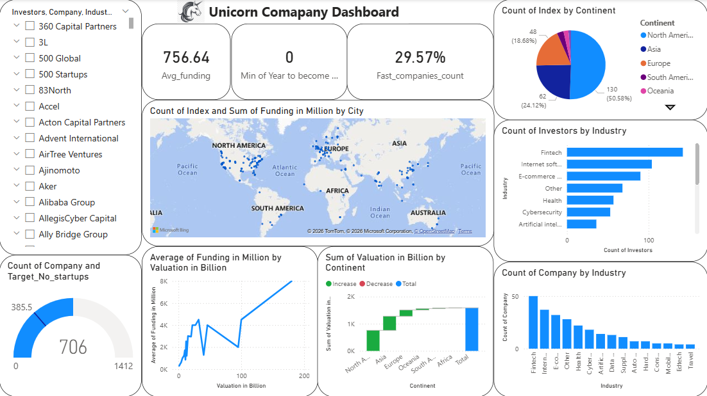

# -Unicorn-Companies-Dashboard

## 📌 Project Overview
The venture capital landscape is increasingly competitive. This project analyzes the global **Unicorn Ecosystem** (private startups valued at \$1B+). By transforming raw market data into an interactive intelligence suite, this dashboard provides stakeholders with insights into geographic hubs, high-growth sectors, and investment efficiency.

### 📊 Dashboard Preview

---

### 🎯 Key Business Questions Addressed:
* **Market Distribution:** Which countries and cities are the primary engines of unicorn growth?
* **Industry Trends:** Which sectors (Fintech, AI, E-commerce) command the highest total valuations?
* **Time-to-Unicorn:** What is the average duration for a startup to reach a \$1B valuation?
* **Investment Insights:** Which lead investors have the most significant "hit rate" for unicorns?

---

## 🛠️ Technical Implementation

### 1. Data Transformation (Power Query)
* **Standardization:** Cleaned currency fields by stripping symbols and converting strings to numerical formats for calculation.
* **Feature Engineering:** Created a custom column to calculate the "Velocity to Unicorn" metric:
  $$\text{Years to Unicorn} = \text{Date Joined} - \text{Year Founded}$$
* **Data Granularity:** Handled multi-investor strings by splitting and pivoting to allow for per-investor analysis.

### 2. Data Modeling
* **Schema:** Implemented a **Star Schema** to optimize performance and filter propagation.
* **Calendar Table:** Generated a DAX-based Date Table to enable **Time Intelligence** (YoY Growth, Cumulative Valuations).

### 3. Advanced DAX Measures
Developed custom measures for deep-dive analytics:
* **Total Valuation:** $$Total\ Valuation = SUM('Unicorn_Data'[Valuation\_Amount])$$
* **Capital Efficiency Ratio:** Used to compare Funding vs. Valuation across different industries.
* **Dynamic Ranking:** Implemented `RANKX` to allow users to toggle between Top 5/10/20 Companies by Valuation.

---

## 💡 Key Insights & Recommendations
* **Geographic Shift:** While the US and China lead, significant growth is emerging in the Indian and SE Asian markets.
* **Speed of Growth:** The "Time to Unicorn" has decreased by ~25% in the last 5 years compared to the previous decade, signaling faster capital deployment.
* **Sector Alpha:** Artificial Intelligence and Cybersecurity show the highest Valuation-to-Funding ratios, indicating high investor confidence.

---

## 🚀 How to View
1. Clone this repository.
2. Open the `.pbix` file in **Power BI Desktop**.
3. (Optional) View the PDF export in the repository for a quick preview.

---
